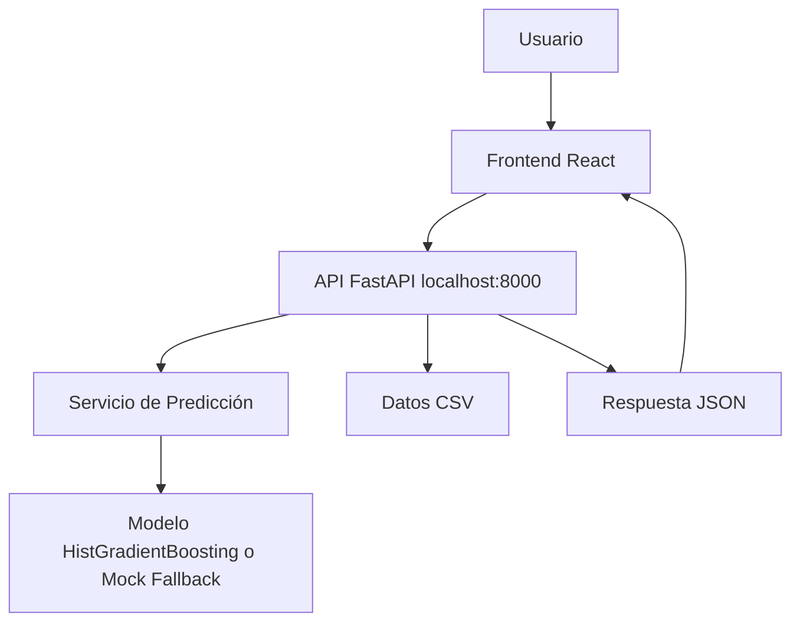

# Arquitectura localhost

La solución se despliega localmente con un frontend React que consume una API FastAPI. El backend valida entradas, consulta el servicio de predicción, calcula reglas de inventario y devuelve respuestas JSON al dashboard.

## Componentes

- Frontend: formulario, panel de resultados, alertas, métricas y arquitectura.
- Backend: endpoints REST, validación Pydantic, CORS, métricas en memoria.
- Modelo: carga `backend/models/model.pkl` si existe; en caso contrario, usa fallback.
- Datos: `backend/data/sample_products.csv` como fuente local de SKUs demo.
